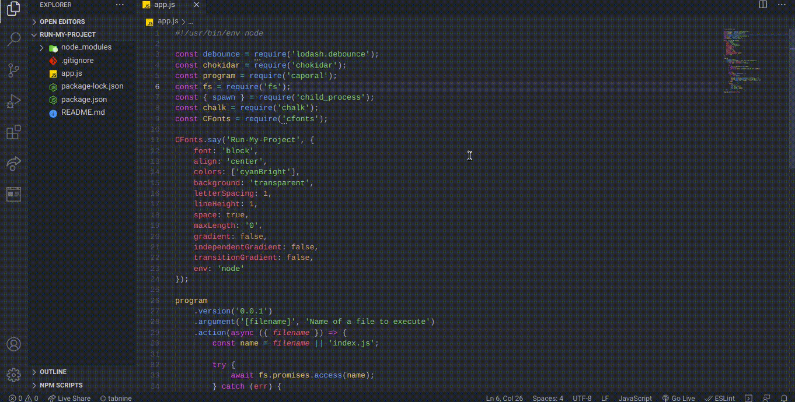

<h1 align='center'>Run-My-Project</h1>

<p align='center' height = 400></p>

This is the project mainly focussed on making the work of a developer as easy as possible. This project will listen to any changes made in the file executed and then start the process again without even terminating and re-running it. 

### Setting it up in local system
1. Clone this repo. - ```git clone https://github.com/pranjals149/Run-My-Project.git```
2. Install the required dependencies - ```npm i```
3. Now run the following command to make it executable - ```chmod +x app.js```(for linux and macOS users)
4. To run this in your app, just type - ```runmyproject <filename.js>```
5. The process monitoring will be started and it will listen to any changes made to the project. 😄

### Extra info. 

For the help manual, type the command - ```runmyproject -h``` 

### Screenshot


<h2 align='center'>Enjoy 😄</h2>
